**AWS Networking Workshop**
--------------------

More and more customers have been migrating their production workloads from on-premises into AWS cloud. But in the mean time, it's a huge challenge on how to connect tens or hundreds of VPC together and still have ability to control routing. Additionally, how to build a hybrid DNS architecture to allow all workloads communicating each other through DNS is a complicated question as well.

The objective of this workshop is to take you to build a hybrid architecture step by step by using three AWS networking services, AWS Transit Gateway, AWS Client VPN and Route53 Resolver. In the workshop, we will create 3 VPCs, 2 of them are application VPC and the other is shared services VPC where we will create AWS managed Microsoft Directory, AWS Client VPN endpoints and DNS service.The diagram below is the architecture we will build in this workshop.    

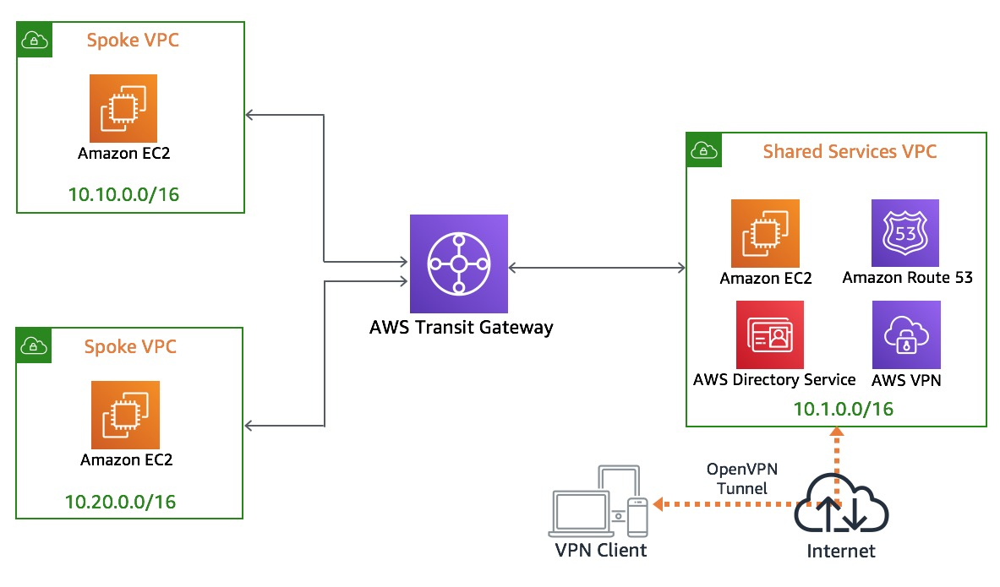

**IMPORTANT** - You Must Select N.Virginia (us-east-1) Region For This Workshop.

**STEP 1 - Enviornment Set-Up**
---------------------------

For avoiding misconfiguration, we will create the workshop environment by using CloudFormation. Copy the link below and past it as the template URL. 

<https://s3.amazonaws.com/ykwang-networking-workshop/networking-workshop.yaml>

1) Choose **Creat new stack** on the CloudFormation page.
 
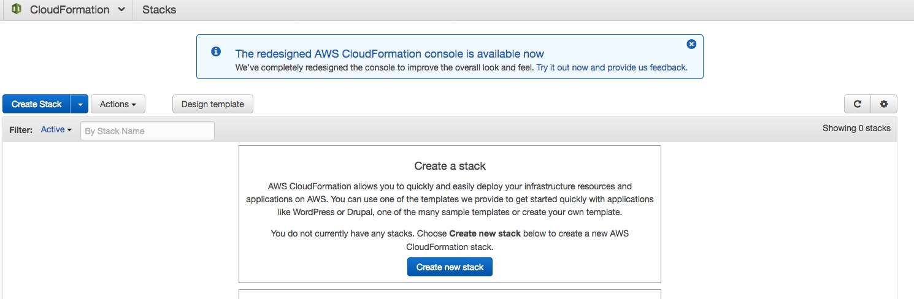

2) Past the link under **Specify an Amazon S3 template URL** and click **Next**.

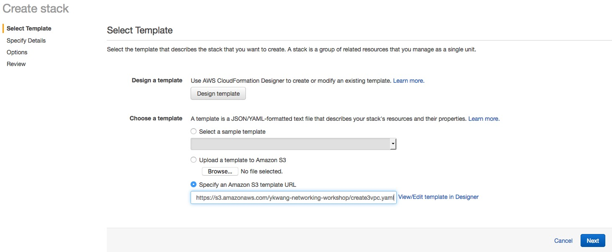

3) Specify your stack name and choose **KeyName** for accessing EC2 via SSH, then click **Next**.

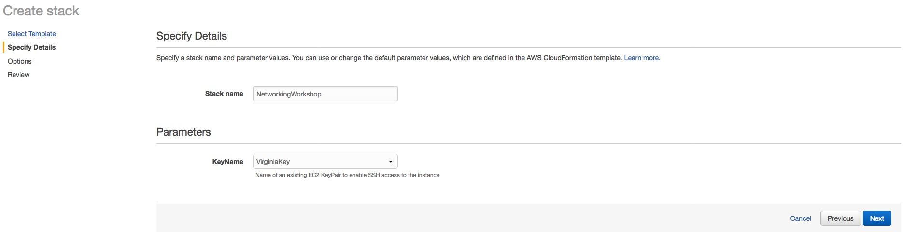

4) Click **Next** to skip **Option** page and click **Create** on **Review** page. CloudFormation will automatically create the VPCs and related resources. Wait about 25 ~ 30 minutes and make sure the status is **CREATE_COMPLETE**.

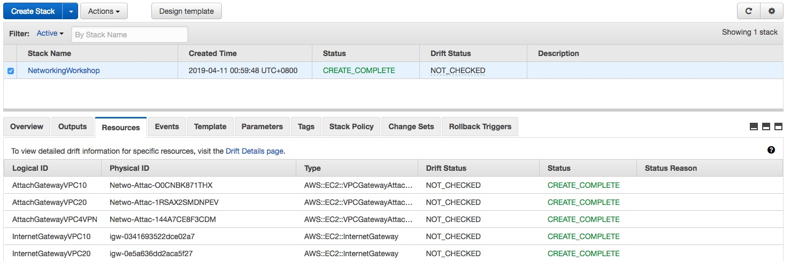

5) Verify all resources CloudFormation created are identical as below.  

**VPC AND SUBNET**

* VPC4VPN - 10.1.0.0/16 (VPC4VPN-SN1 - 10.1.1.0/24, VPC4VPN-SN2 - 10.1.2.0/24)
* VPC10 - 10.10.0.0/16 (VPC10-SN1 - 10.10.1.0/24, VPC10-SN2 - 10.10.2.0/24)
* VPC20 - 10.20.0.0/16 (VPC20-SN1 - 10.20.1.0/24, VPC20-SN2 - 10.20.2.0/24)

**EC2 INSTANCE (Record your EC2 private IP)**

* ICMP Client in VPC10 - IP 10.10.1.X
* ICMP Client in VPC20 - IP 10.10.2.X

**Directory Service (Record MicrosoftAD DNS address)**

**STEP 2 - Create VPN User In Microsoft AD**
---------------------------
To create users and groups in an AWS Directory Service directory, you must be connected to a EC2 instance that has been joined to your AWS Directory Service directory, and be logged in as a user that has privileges to create users and groups. You will also need to install the Active Directory Tools on your EC2 instance so you can add your users and groups with the Active Directory Users and Computers snap-in. 

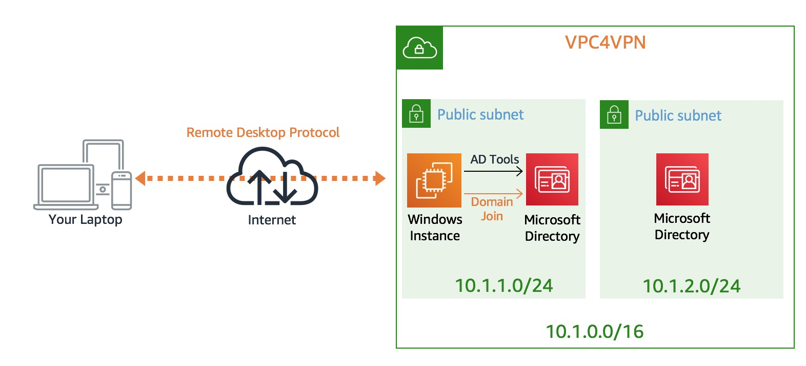

1) Create a DHCP Options Set for Your Directory

Open the Amazon VPC console and choose **DHCP Options Sets** in the navigation pane. Then choose Create DHCP options set. Type a name you like and type **workshop.aws.com** for **Domain name**. For **Domain name servers**, type the IP addresses of directory's DNS IP you just created. Leave the settings blank for **NTP servers**, **NetBIOS name servers**, and **NetBIOS node type**. Choose **Create DHCP options set**. Make a note of the ID of the new set of DHCP options (dopt-xxxxxxxx).

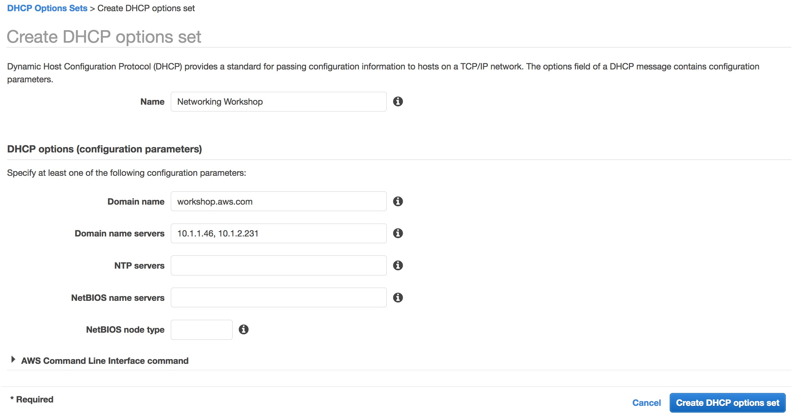

2) Apply DHCP Options Set to VPC4VPN

Back to VPC console, select **VPC4VPN**, choose **Actions**, and then choose **Edit DHCP Options Set**. 

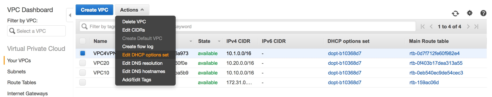

In the Edit DHCP Options Set dialog box, select the options set that you recorded in last step. Then choose Save. 

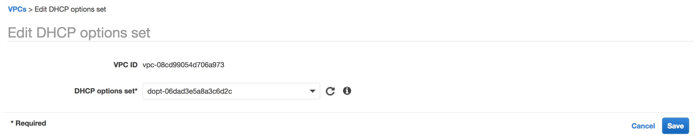

3) Create a Windows Instance and Automatically Join the Directory

Open the Amazon EC2 console, choose Launch Instance and select **Microsoft Windows Server 2016 Base AMI**. On the page of **Configure Instance Details**, do the following:

* Choose **VPC4VPN** for **Network**
* Choose **VPC4VPN-SN1** for **Subnet**
* Choose **Use subnet setting(Enable)** for **Auto-assign Public IP**
* Choose **workshop.aws.com** for **Domain join directory**

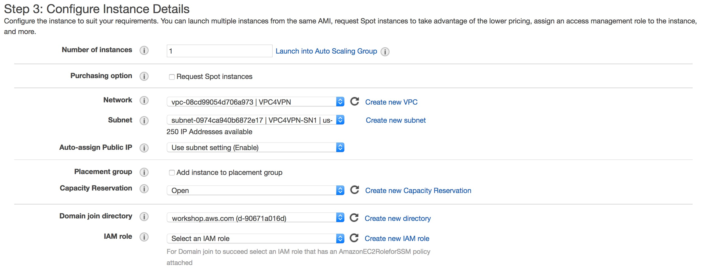

Click **Create new IAM role** to create a new IAM role and attach the AmazonEC2RoleforSSM policy. Under **Select your use case**, choose **EC2**, and then choose **Next**. Type **AmazonEC2RoleforSSM** at search bar, select it and then choose **Next**.

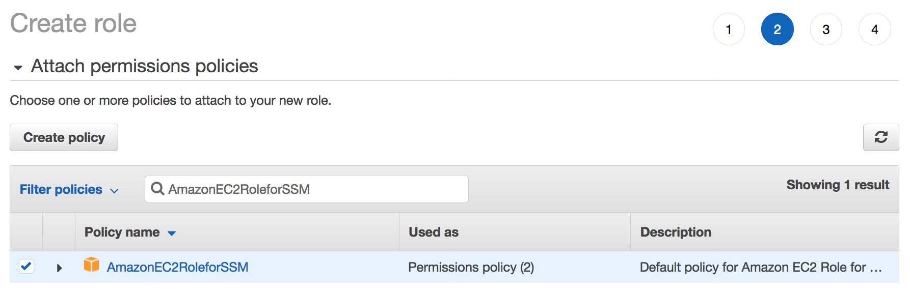

For **Role name**, enter a name for your new role (such as EC2DomainJoin). Then choose Create role.

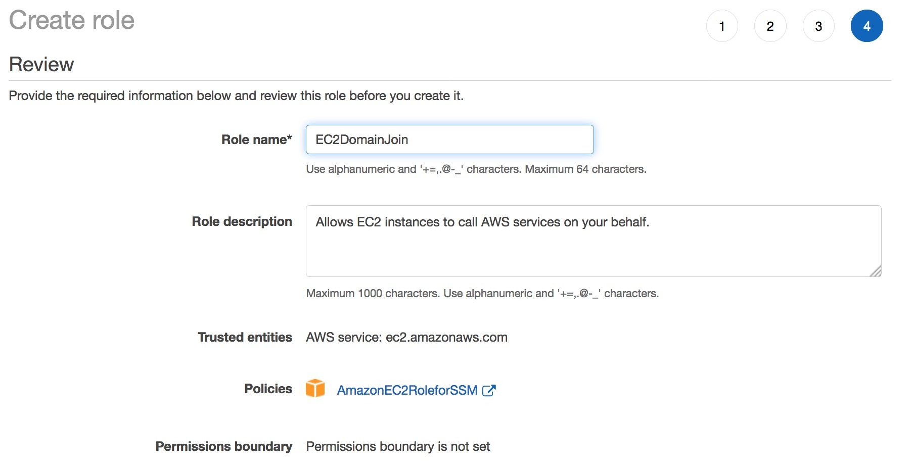

Back to the page of **Configure Instance Details**, select **EC2DomainJoin** for **IAM role**.

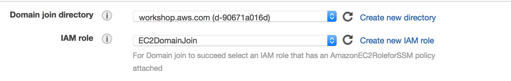

Keep the setting default on the page of **Add Storage**, add key:**Name** and value:**WinServer** for tag, choose **Select an existing security group** and select the security group with name **Allow RDP and ICMP** and then click **Review and Launch**. Click **Launch** again and select a keypair for this workshop. 

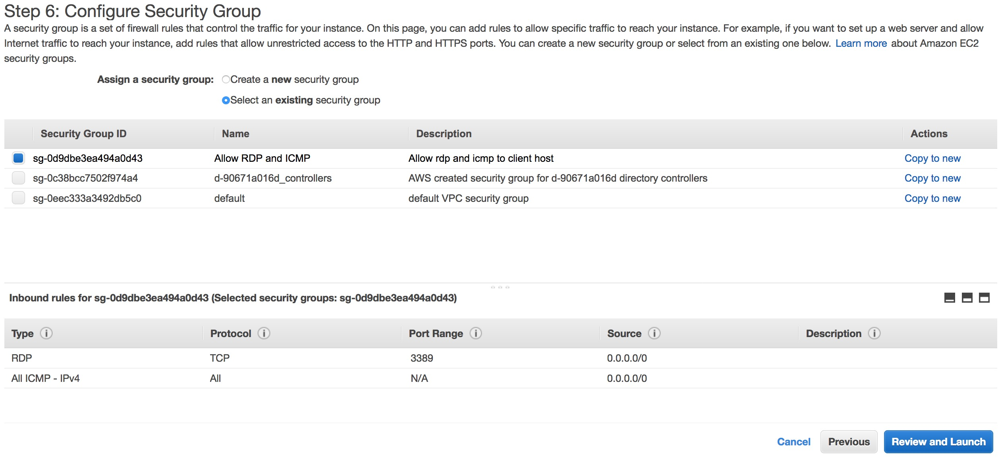

4) Install the Active Directory Tools on Your EC2 Instance

Open EC2 console, download Remote Desktop File and get the administrator password.

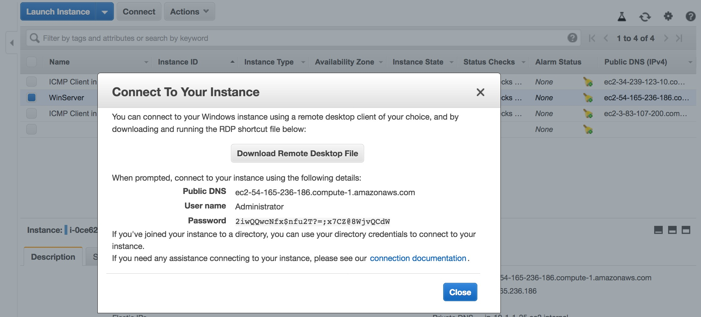

Open your RDP software and login Windows instance with username:Administrator and password you just decrypted and then do the following:

From the Start menu, choose Windows PowerShell and Copy the following command.

	Install-WindowsFeature -Name GPMC,RSAT-AD-PowerShell,RSAT-AD-AdminCenter,RSAT-ADDS-Tools,RSAT-DNS-Server

**IMPORTANT** After installation of AD tools, logout and re-login with domain administrator. Use **workshop.aws.com\admin** as username and **Passw0rd!** as password.  

5) Create a Group and a User

From the Start menu, choose **Active Directory Users and Computers**. In the directory tree, select **Users** OU under **workshop** directory and click **Action**, click **New** to create a **Group**. Type VPN Users for **Group name** and click **OK**. 

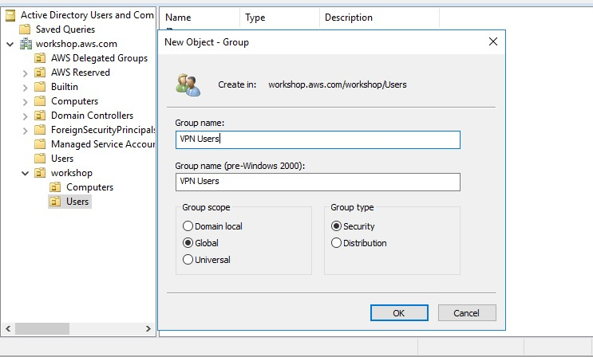

Click **Action** to create a **User**. Type **First name**, **Last name**, **User logon name** and click **Next**. On the second page of the wizard, type a password in **Password** and **Confirm Password**. Uncheck **User must change password at next logon**, select **Password never expires** and then click **Next** click **Finish**

Right click at **VPN Users** group, choose **Properties** and click **Members** to add the user to this user group.

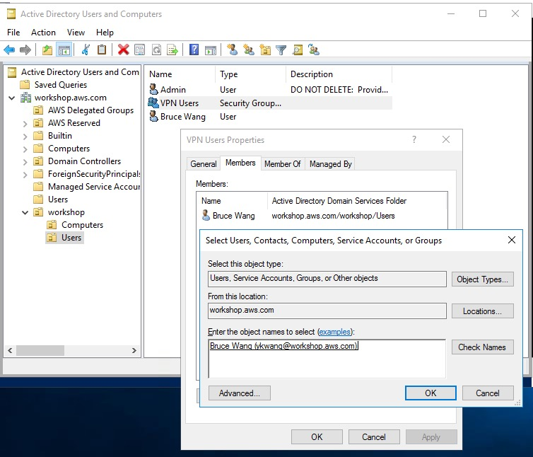

**STEP 3 - Create AWS Client VPN**
----------------------------------------------
**What is AWS Client VPN?**

AWS Client VPN is a managed client-based VPN service that enables you to securely access your AWS resources and resources in your on-premises network. With Client VPN, you can access your resources from any location using an OpenVPN-based VPN client. 

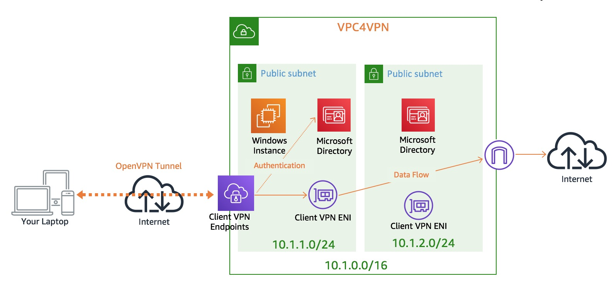

1) Generate a Server Certificate and import into ACM

**IMPORTANT** - AWS CLI tool is essential in this step. If the laptop you use without AWS CLI tool, you can ssh to EC2 instance in VPC10 to complete it.  

Follow the instruction below to generate a server certificate and upload it into ACM.

1. Clone the OpenVPN easy-rsa repo to your local computer.

		$ git clone https://github.com/OpenVPN/easy-rsa.git
		
2. Navigate into the easy-rsa/easyrsa3 folder in your local repo. 

		$ cd easy-rsa/easyrsa3
		
3. Initialize a new PKI environment.

		$ ./easyrsa init-pki
		
4. Build a new certificate authority (CA).

		$ ./easyrsa build-ca nopass
		
5. Generate the server certificate and key.

		$ ./easyrsa build-server-full server nopass

6. Copy the server certificate and key to a custom folder and then navigate into the custom folder. 

		$ cp pki/ca.crt /custom_folder/
		$ cp pki/issued/server.crt /custom_folder/
		$ cp pki/private/server.key /custom_folder/
		$ cd /custom_folder/
		
7. Upload the server certificate and key to ACM.

		$ aws acm import-certificate --certificate file://server.crt --private-key file://server.key --certificate-chain file://ca.crt --region us-east-1

Open **Certificate Manage** console, expand the details page of certificate you just imported and record the resource ARN.

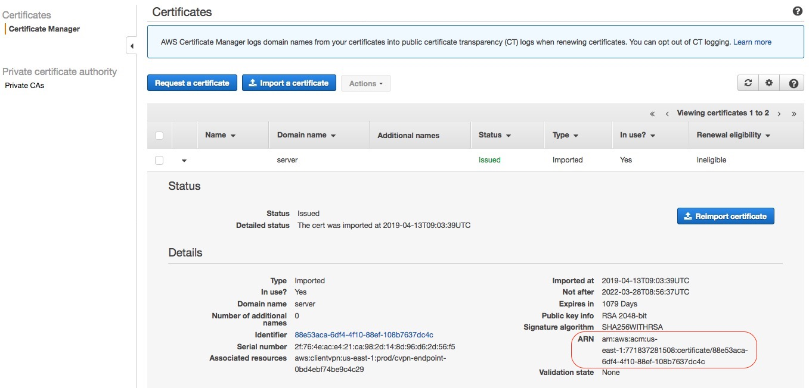

2) Create a Client VPN Endpoint

Open the Amazon VPC console, choose **Client VPN Endpoints** and choose **Create Client VPN Endpoint**. Do the following:

* Type **Networking Workshop** for **Name Tag**
* Type **192.168.200.0/22** for **Client IPv4 CIDR**
* Select **arn:aws:acm:us-east-1:xxx:certificate:xxxx** for **Server certificate ARN**
* Choose **Use Active Directory authentication** for **Authentication Options**
* Select **d-xxxxxxxxxx** for **Directory ID**
* Select **No** for **Connection Logging**
* Leave **DNS IP address** as blank and select **UDP** for 
**Transport Protocol**

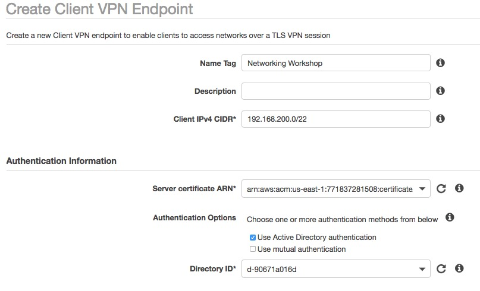

3) Configure Client VPN Endpoint

Select the client VPN endpoint and choose **Associations**, click **Associate**. Select the vpc-id of **VPC4VPN** for **VPC** setting and select subnet-id with us-east-1a for **Choose a subnet to associate**.

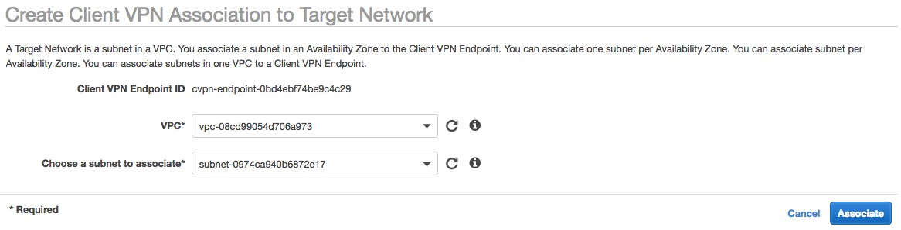

The VPC's default security group is automatically applied for the subnet association. Make sure all traffic is allowed for inbound rules and outbound rules . Select the client VPN endpoint and choose **Authorization**, click **Authorize Ingress**. Type **0.0.0.0/0** for **Destination network to enable**, select **Allow access to all users** and click **Add authorization rule**.

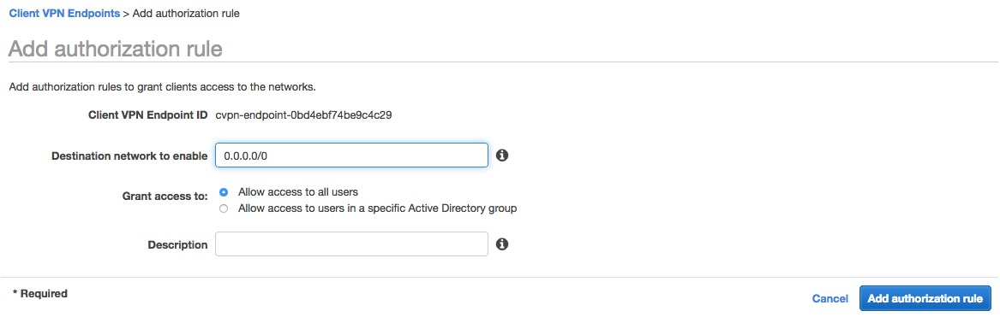

Click **Route Table** and **Create Route**. Type **0.0.0.0/0** for Route destination and select **subnet-xxxx** for **Target VPC Subnet ID**.

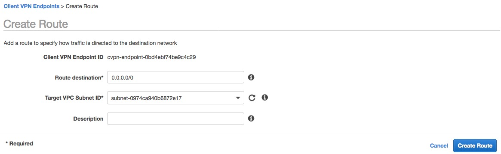

Click **Summary** to review the setting and go through each tab.

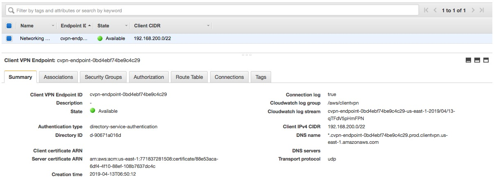

4) Connect Your AWS Client VPN

**IMPORTANT** - Make sure you've installed OpenVPN client in your laptop or mobile device. If not, check the link below to install.

* Windows - <https://docs.aws.amazon.com/vpn/latest/clientvpn-user/windows.html>
* MacOS - <https://docs.aws.amazon.com/vpn/latest/clientvpn-user/macos.html>
* Android and iOS - <https://docs.aws.amazon.com/vpn/latest/clientvpn-user/android.html>

Click **Download Client Configuration** and store the ovpn file in your loacl disk.

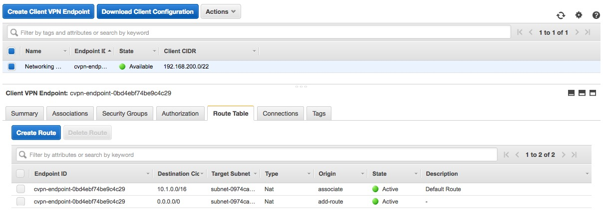

In this step, the illustration was captured from Tunnelblick which is a free OpenVPN client for MacOS. You can reference the steps because the working process of most OpenVPN clients is similar. 
Open your OpenVPN client and import the OpenVPN config(.ovpn file). Click **connect**, type the username and password that you created for vpn user in Active Directory. The OpenVPN client will automatically establish VPN connection between AWS Client VPN endpoints and your laptop.

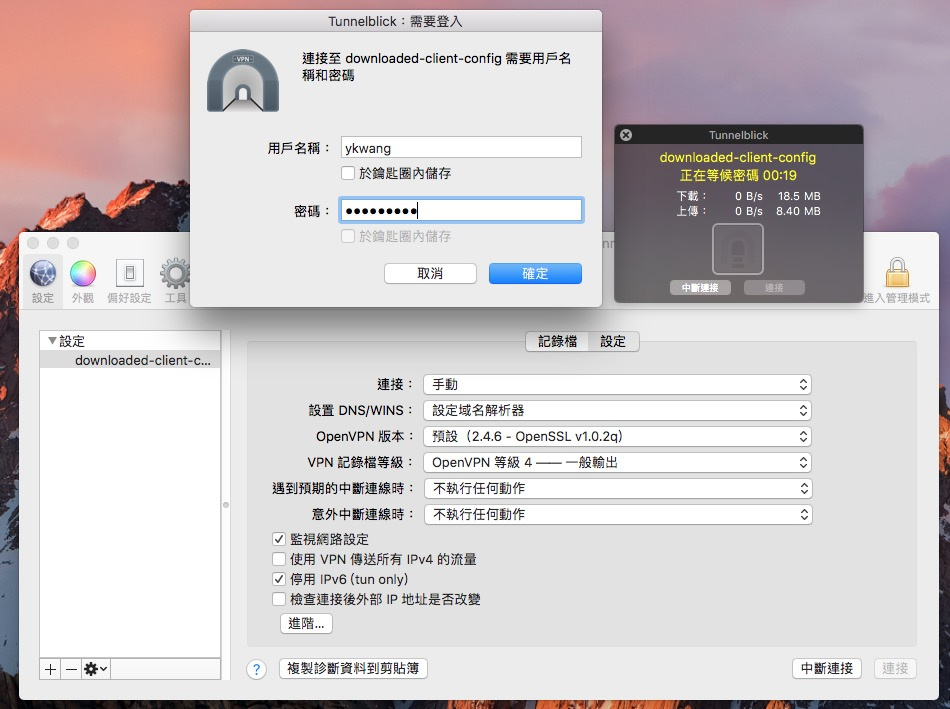

Back to **Client VPN Endpoints** console, click **Connections** to check the connection status. You can also check the status at your laptop by using command like **ifconfig**, **netstat -rn** for MacOS or **ipconfig** and **route print** for Windows.
 
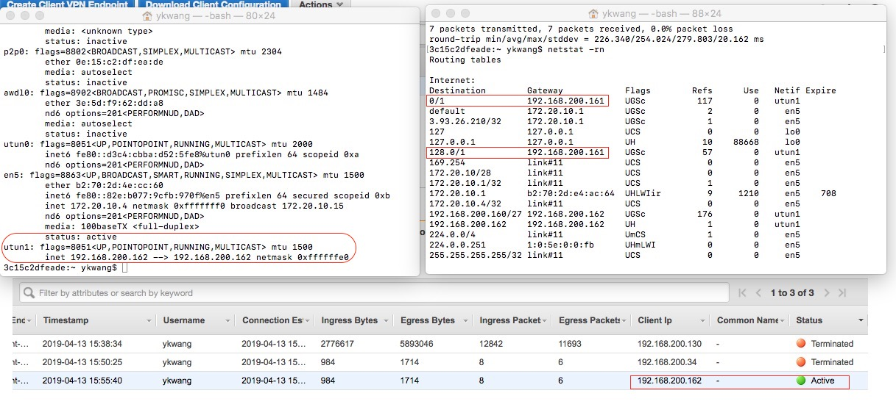

5) Test your VPN Connection

* Open you browser and link to <https://www.whatismyip.com/>
* Ping 168.95.1.1
* Ping www.amazon.com

Awesome!! Public IP is from Ashburn, VA US owned by Amazon. In term of ping result, we know the connectivity is available but the RTT is not good enough. The reason is that all traffic routing to the destination will be encapsulated and transmitted over OpenVPN tunnel. And the source IP address will be translated to EIP of Client VPN ENI hosted in subnet **VPC4VPN-SN1** or **VPC4VPN-SN2**. That's the reason why **"whatismyip"** shows your location in Virginia not your real location.

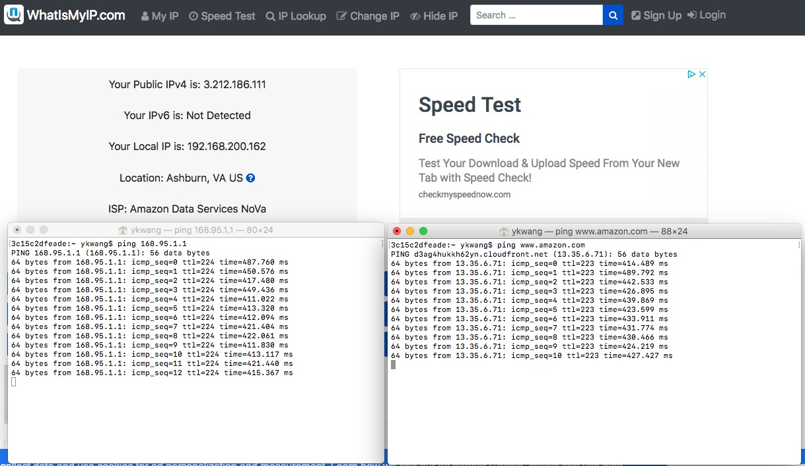

**Noted**

If you try to ping the Windows instance in VPC4VPN, don't forget to turn off the Windows firewall, otherwise the icmp will be blocked by Windows host firewall. 

Turn Windows Defender Firewall Off - <https://support.microsoft.com/en-us/help/4028544/windows-10-turn-windows-defender-firewall-on-or-off>  

Ping the Linux instances located in VPC10 to verify whether the vpn connection can reach to other VPCs. The answer is no because there is no routing information between VPC4VPN and VPC10. 

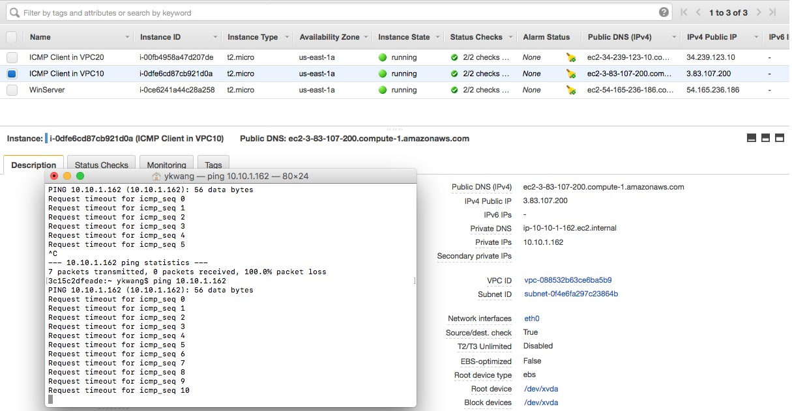

**STEP 4 - Create AWS Transit Gateway**
----------------------------------------------
**What is AWS Transit Gateway?**

A transit gateway acts as a regional virtual router for traffic flowing between your virtual private clouds (VPC) and VPN connections. A transit gateway scales elastically based on the volume of network traffic. Routing through a transit gateway operates at layer 3, where the packets are sent to a specific next-hop attachment, based on their destination IP addresses.

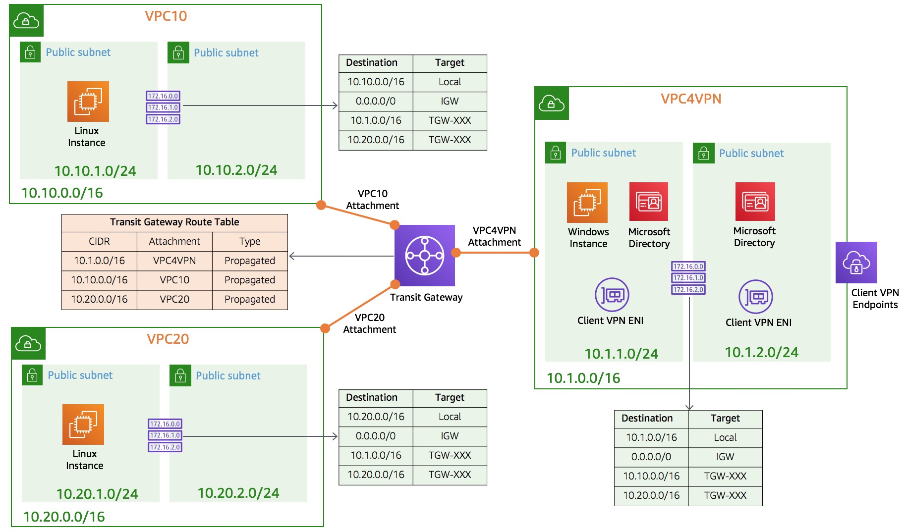

1) Create the Transit Gateway

Open the Amazon VPC console, choose **Transit Gateways** and **Create Transit Gateway**. Type **Networking Workshop** for **Name tag** and leave others setting as default.

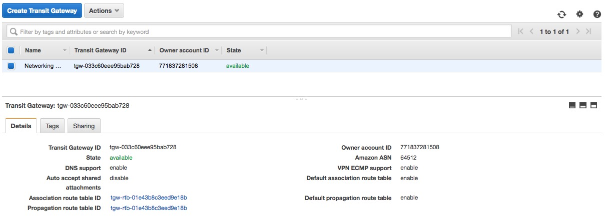

2) Attach Your VPCs to Your Transit Gateways

Choose **Transit Gateway Attachments** and **Create Transit Gateway Attachment**. Select **tgw-xxxxxx** and choose **VPC** for **Attachment type**. 

Type **VPC4VPN** for **Attachment name tag**, select **VPC4VPN** for **VPC ID**. Select **us-east-1a** and **us-east-1b** for **Subnet IDs**.

Repeat the step above to create the attachments for VPC10 and VPC20. Verify the final state of each VPC is **available**.

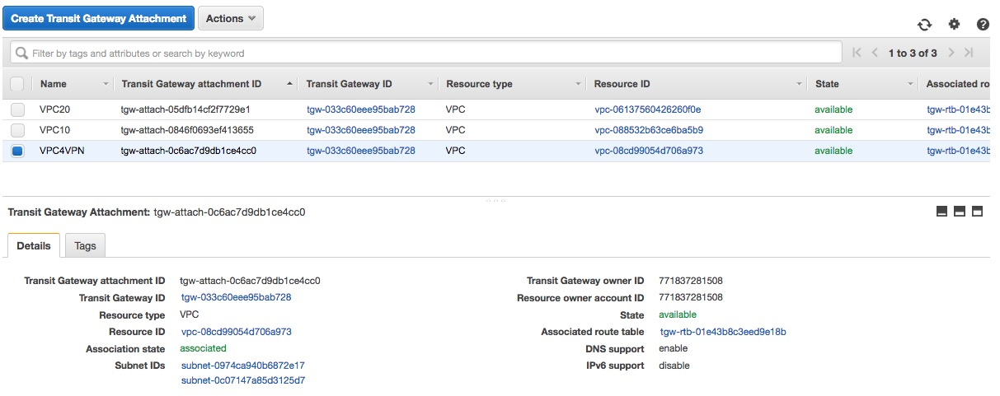

3) Verify Transit Gateway Route Tables

Choose **Transit Gateway Route Tables** and go through each tab. Make sure the CIDR of each VPC is listed under the **Routes** tab.

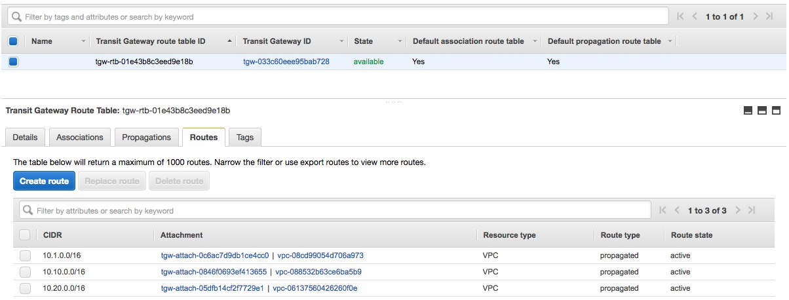

4) Add Routes between the Transit Gateway and your VPCs

Choose **Route Tables**, select **VPC4VPN-RT** and click **Edit routes** under **Routes** tab.

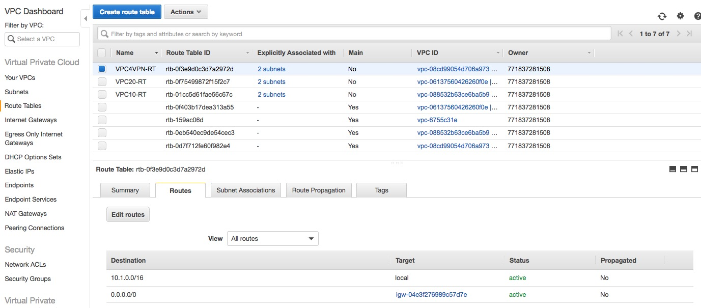

Click **Add route**, type **10.10.0.0/16**,**10.20.0.0/16** for **Destination** and select **tgw-xxxxxxx** for **Target**.

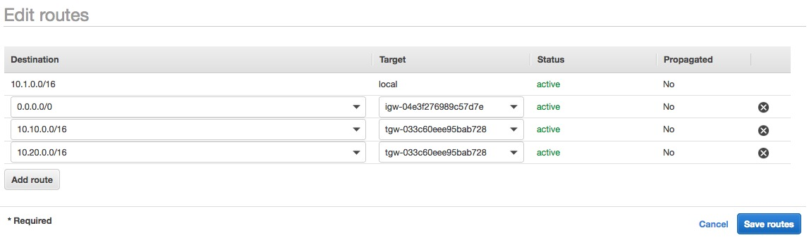

Repeat the step above to add the routes to **VPC10-RT** and **VPC20-RT**. Verify that the CIDR of each VPC is included in every route table. 

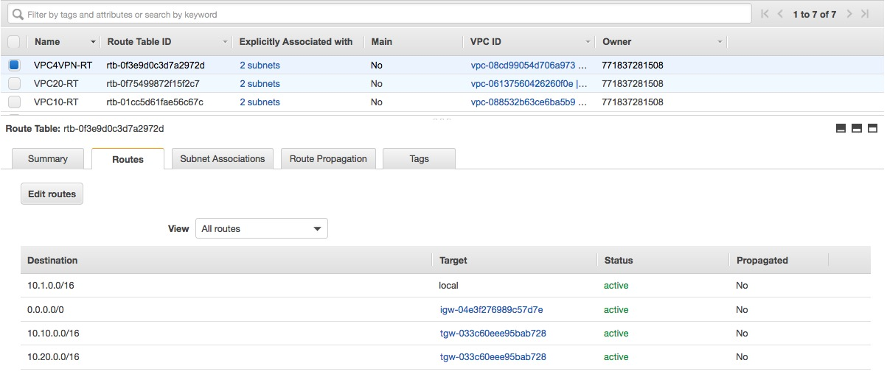

5) Test the Connectivity Between Client VPN and VPC10/VPC20

Find the private IP of instance located in VPC10/VPC20. Back to the EC2 console, select the instance with name of "ICMP Client in VPC10" and you will see **Private IPs** under **Description**. In my EC2 console, the private IPs are:

* ICMP Client in VPC10 - 10.10.1.162
* ICMP Client in VPC20 - 10.20.1.152  

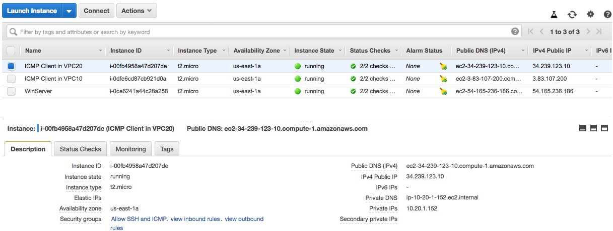

Confirm the OpenVPN tunnel is still connected, open a terminal window and ping the two private IPs to see whether the Transit Gateway is working well.

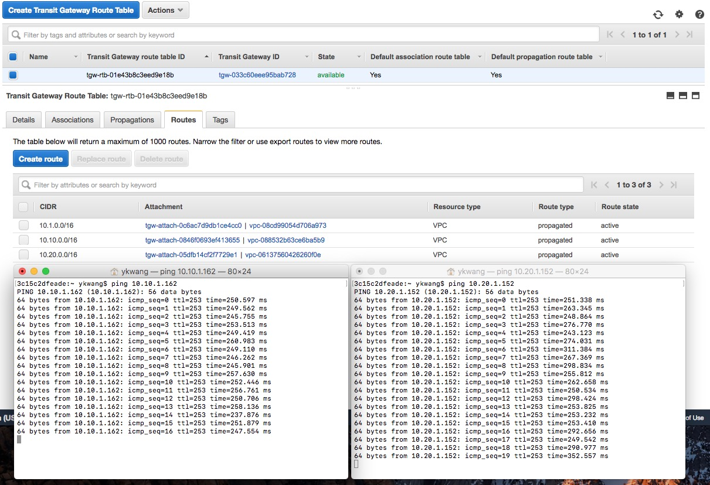

You can ssh into the Linux instance in VPC10 and ping the private IP of instance in VPC20. In the diagram below, in addition to IP, the internal domain name of instance can be used to test too. Do you know why?

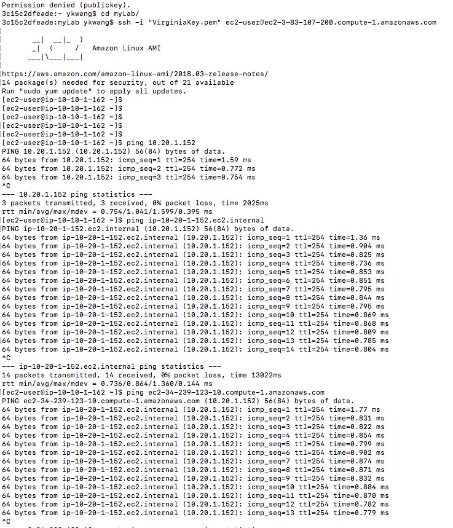

**STEP 5 - AWS Route 53 and DNS Resolver**
----------------------------------------------
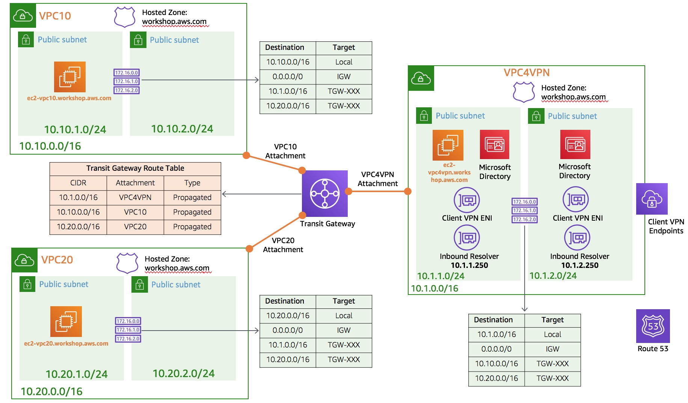

1) Create a Route 53 Private Hosted Zone for VPCs

Open Route 53 console, choose **Hosted zones** and click **Create Hosted Zone**. Type your domain name (ex. workshop.aws.com) and select **Private Hosted Zone for Amazon VPC** for **Type**. Finally, select the VPC for this workshop under **N.Virginia** region and click **Create**. 

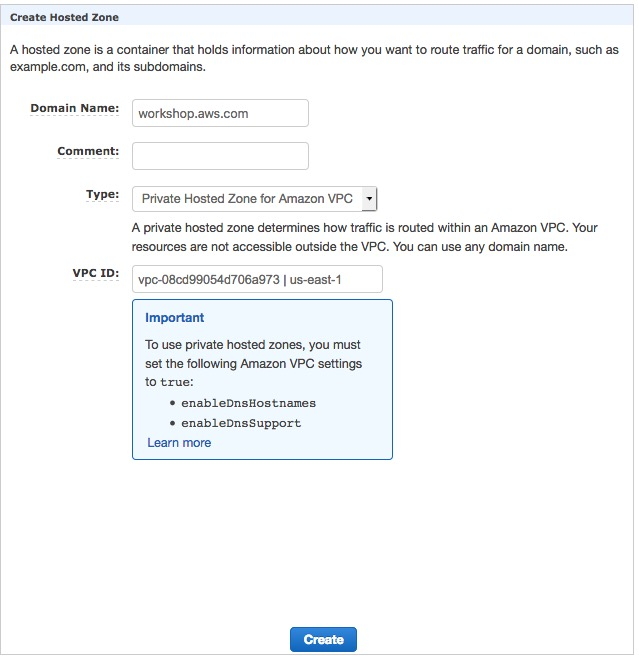

After hosted zone successfully created, click **Back to Hosted Zones** and select your domain name. Associate the other two VPCs (VPC10 and VPC20) to the hosted zone.

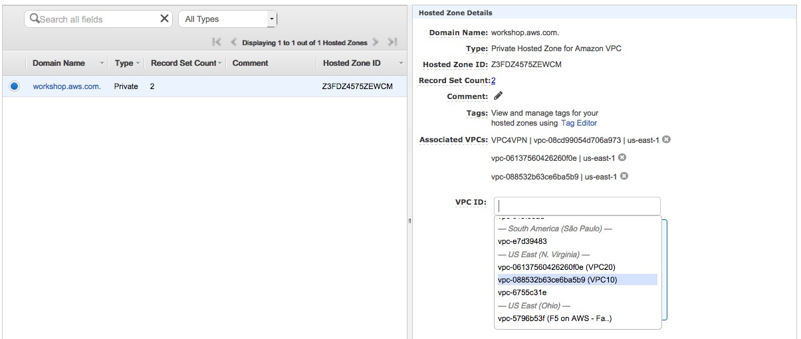

2) Create Domain Name for Instances

Choose **Create Record Set** and do the following:

**Instance in VPC4VPN**
	
	Name: ec2-vpc4vpn
	Type: A-IPv4 address
	Alias: No
	TTL: 0
	Value: your instance private ip in VPC4VPN (ex. 10.1.1.25)
	Routing Policy: Simple  
	
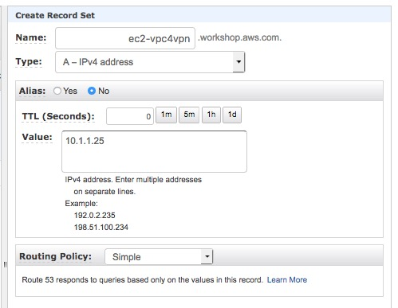

Repeat the step above to create A record for instances in VPC10 and VPC20
	
**Instance in VPC10**
	
	Name: ec2-vpc10
	Type: A-IPv4 address
	Alias: No
	TTL: 0
	Value: your instance private ip in VPC10 (ex. 10.10.1.162)
	Routing Policy: Simple 
	
**Instance in VPC20**
	
	Name: ec2-vpc20
	Type: A-IPv4 address
	Alias: No
	TTL: 0
	Value: your instance private ip in VPC20 (ex. 10.20.1.152)
	Routing Policy: Simple 

Confirm the DNS records are created successfully. 

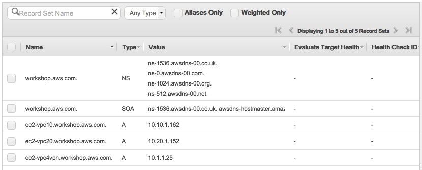

3) Create Route 53 Resolver

Back to EC2 console, create a Security Group with inbound rule of allowing TCP/UDP port 53 from anywhere. The Security Group will be applied to the Route 53 Inbound Resolver.

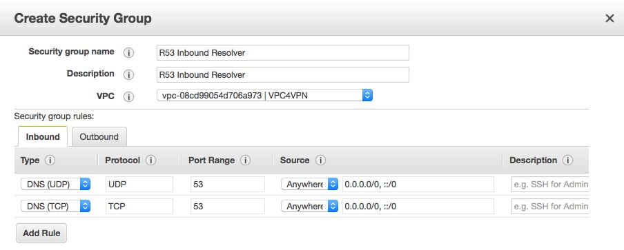

Choose **Inbound endpoints** in the navigation pane, click **Create inbound endpoint** and do the following:

* Endpoint name: EndpointForVPN
* VPC in the Region: VPC4VPN
* Security group for this endpoint: R53 Inbound Resolver

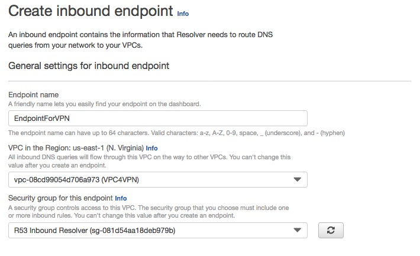

* IP address #1

		Availability Zone: us-east-1a
		Subnet: VPC4VPN-SN1
		IP address: Select "Use an IP address that you specify" and type 10.1.1.250 
		
* IP address #2

		Availability Zone: us-east-1b
		Subnet: VPC4VPN-SN2
		IP address: Select "Use an IP address that you specify" and type 10.1.2.250 
	
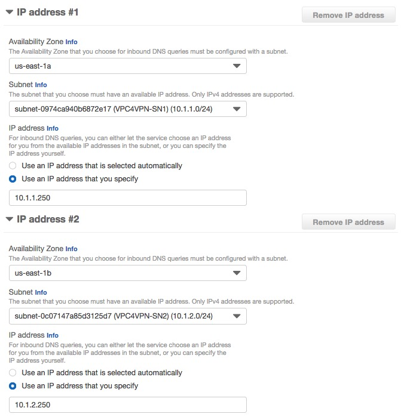

Select the inbound endpoint you created, click **View details**.

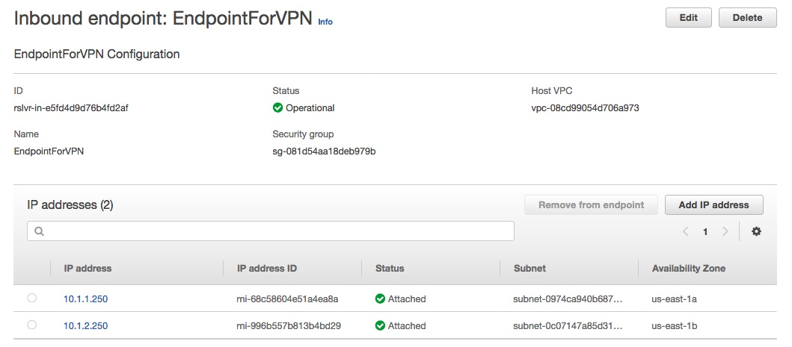

4) Add Inbound Resolver IP to AWS Client VPN Endpoints

Back to **Client VPN Endpoints** console, select your endpoint, click **Action** and choose **Modify Client VPN Endpoint**.

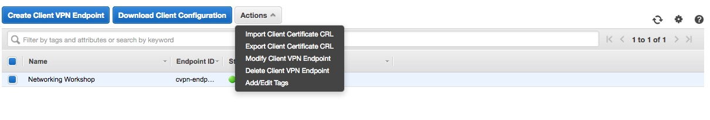

Select **Yes** for **DNS Servers enabled** and type **10.1.1.250** and **10.1.2.250** for DNS Server IP. Leave others setting as blank and click **Modify Client VPN Endpoint**.

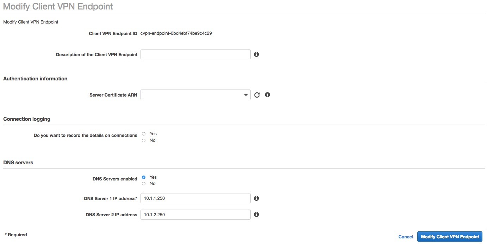

5) Test Connectivity With Domain Name

Reconnect your OpenVPN and verify that the DNS server IPs of your laptop are **10.1.1.250** and **10.1.2.250**. Use command like **nslookup** or **dig** to query the domain name of instance in VPC10/VPC/20.  

	$ nslookup
	> server
	> ec2-vpc4vpn.workshop.aws.com
	> ec2-vpc10.workshop.aws.com
	> ec2-vpc20.workshop.aws.com

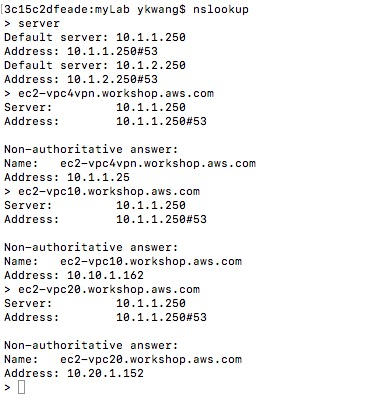

Ping the domain name of instances and browse **www.amazon.com**.

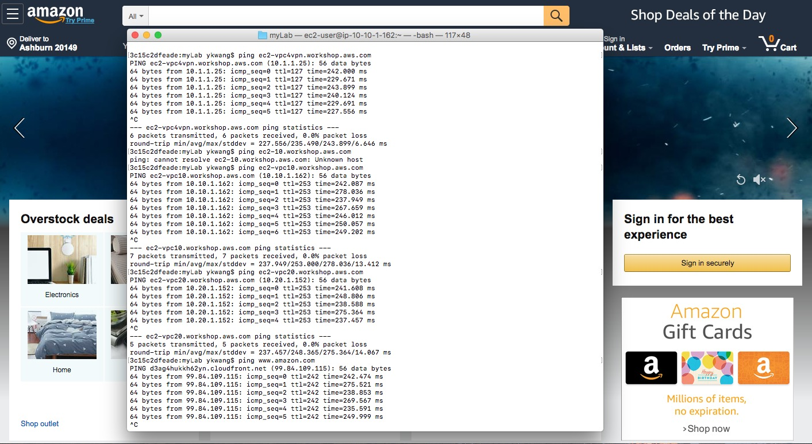

**AWESOME!! WE SUCCESSFULLY CONNECT THE AWS CLOUD AND INTERNET THROUGH AWS CLIENT VPN. IF YOU WANT TO BE AN AWS NETWORK EXPERT, THERE ARE SOME CHALLENGING LABS FOR YOU IN NEXT CHAPTER**

**Challenge - Integrate with Site-to-Site VPN**
----------------------------------------------
In most hybrid cloud environment, creating a site to site VPN is always the first choice for customers to interconnect on-premises and AWS cloud in day one because of convenience and cost-effective. So, we will launch a Cisco CSR1000V to simulate an on-premises router and create a site-to-site VPN connection between CSR1000V and AWS Transit Gateway. Additionally, we will also create two Transit Gateway route tables for isolating the traffic in two different traffic types.

Type 1 - All traffic between VPC10 and VPC20 is prohibited

Type 2 - All traffic is allowed except type 1

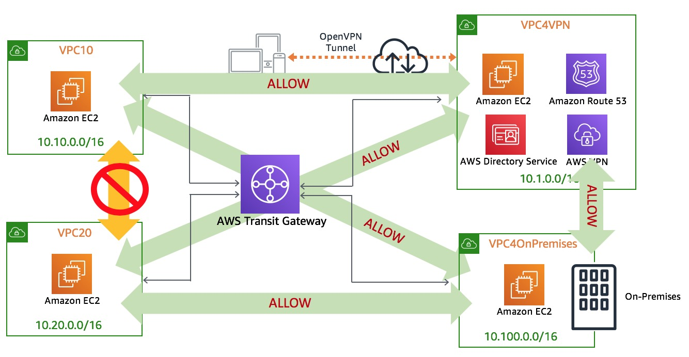

1) Create a VPC to Simulate On-Premises Environment

Before we start launching the Cisco CSR1000V, create the VPC resources listed below. (You must create the resources manually because the CloudFormation template you ran in **Step 1** didn't cover this part. 

* VPC Name: **VPC4OnPremises**
* VPC CIDR: **10.100.0.0/16**
* Internet Gateway Name: **VPC4OnPremises-IGW**
* Subnet Name: **VPC4OnPremises-PublicSN** and **VPC4OnPremises-PrivateSN**
* Subnet CIDR: **10.100.1.0/24** for **VPC4OnPremises-PublicSN** 
* Subnet CIDR: **10.100.2.0/24** for **VPC4OnPremises-PrivateSN**
* Route Table Name: **VPC4OnPremises-RT**
* Add default route to **VPC4OnPremises-RT** and configure **VPC4OnPremises-IGW** as target
* Associate subnet **VPC4OnPremises-PublicSN** to route table **VPC4OnPremises-RT**

2) Launch a Cisco CSR1000V

On EC2 console, click **Launch Instance**, select **AWS Marketplace** and search "CSR1000V".

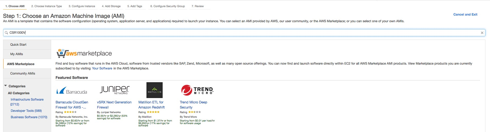

Click **Select** on the right of **Cisco Cloud Services Router (CSR) 1000V - AX Pkg. Max Performance**.

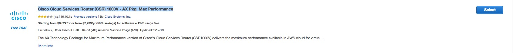

Select **t2.medium** for instance type and on the page of **Step 3: Configure Instance Details**, do the following:

* Choose **VPC4OnPremises** for **Network**
* Choose **VPC4OnPremises-PublicSN** for **Subnet**
* Choose **Enable** for **Auto-assign Public IP**

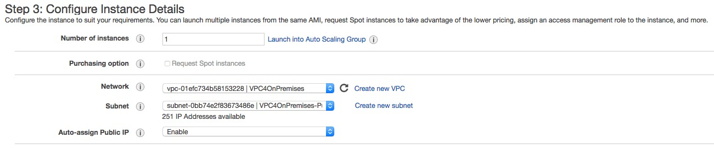

Confirm the **Volume Type** is **General Purpose SSD(gp2)** on the page of **Add Storage**. Add key:**Name** and value:**CSR1KV** for tag, select **Create a new security group** and modify the rule as below.

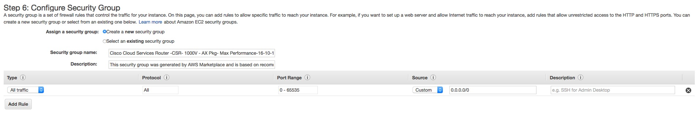

Click **Review and Launch**, click **Launch**, select your key pair and click **Launch Instances**.

SSH into the CSR1KV with user name **ec2-user** not **root**, and you will see the output like this.

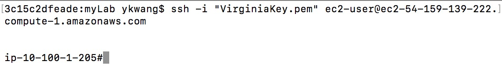

**IMPORTANT** You must disable **Source/Dest. Check** of CSR1000V to allow traffic to be routed by CSR1000V

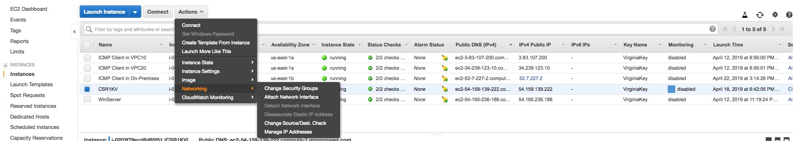

3) Create a Site-to-Site VPN

On the VPC console, select **Customer Gateways** and click **Create Customer Gateway**. Type the following parameters on the page of **Create Customer Gateway**.

* Name: CSR1KV
* Routing: Dynamic
* BGP ASN: 65001
* IP Address: Public IPv4 Address of CSR1000V 

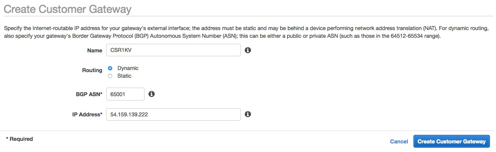

Choose **Transit Gateway Attachments** in the navigation pane, click **Create Transit Gateway Attachment** and type the parameters as the following then click **Create attachment**.

* Transit Gateway ID: Networking Workshop
* Attachment type: VPN
* Customer Gateway: Existing
* Customer Gateway ID: The ID of CSR1KV
* Routing Options: Dynamic (requires BGP)
* Inside IP CIDR Tunnel 1: 169.254.100.0/30
* Pre-Shared Key for Tunnel 1: Passw0rd
* Inside IP CIDR Tunnel 2: 169.254.200.0/30
* Pre-Shared Key for Tunnel 1: Passw0rd

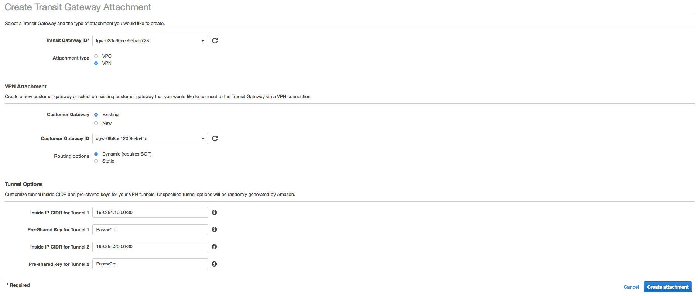

You will see the new Transit Gateway attachment in the console. Wait a period of time until the **State** of the VPN attachment changes to **available**. Choose **Site-to-Site VPN Connections** in the navigation pane, select the connection which has Transit Gateway ID and click **Download Configuration**. Select **Cisco Systems, Inc.** for Vendor, **CSRv AMI** for Platform and **IOS 12.4+** for Software. Click **Download** and save the file in your local disk.

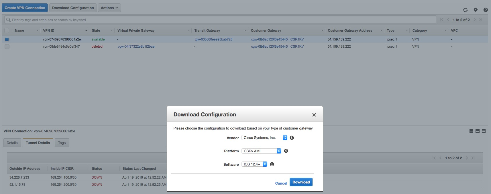

We have to modify the router configuration file to fulfill the scenario we simulate that the routing entry of **VPC4OnPremises-PrivateSN** (10.100.2.0/24) will be only advertised to Transit Gateway. So,there are 3 steps you must do before copy the sample config into your CSR1KV.

1.Edit the sample config and use the private IPv4 address of CSR1000V as the **local-address** IP and **tunnel source** IP. 

**IMPORTANT**

There are six places you need to modify in the sample config which is under **ISAKMP** and **Tunnel** configuration part.

Type the private IPv4 address of CSR1000V to replace the parameter behind **local-address**. (ex: local-address 10.100.1.205)

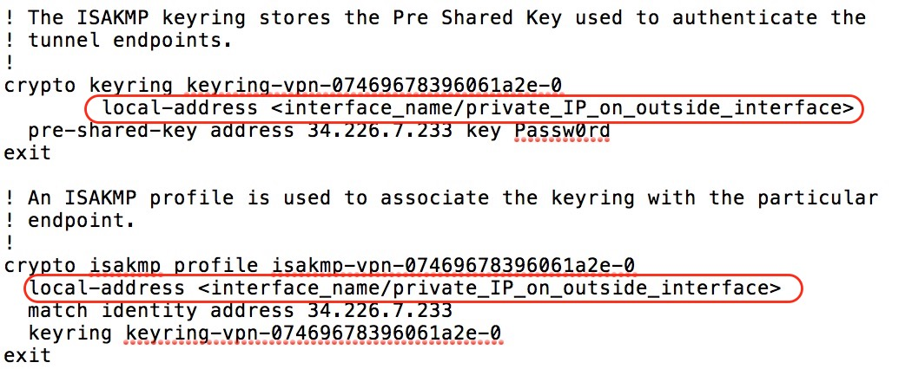

Type the private IPv4 address of CSR1KV to replace the parameter behind **tunnel source**. (ex: tunnel source 10.100.1.205)

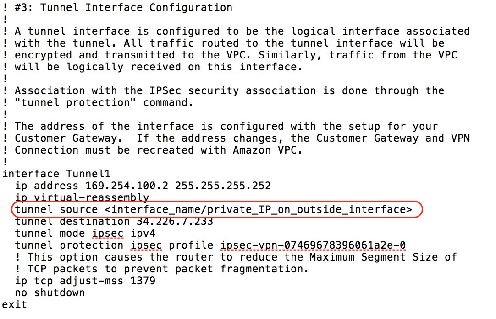

2.Remove the commands under BGP configuration listed below:

* **neighbor 169.254.100.1 default-originate**
* **neighbor 169.254.200.1 default-originate**
* **network 0.0.0.0**

3.Add the commands listed below and type **show run | begin bgp** to verify the BGP configuration is identical as screenshot. 

* **network 10.100.2.0 mask 255.255.255.0** under BGP configuration.
* **ip route 10.100.2.0 255.255.255.0 10.100.1.1**

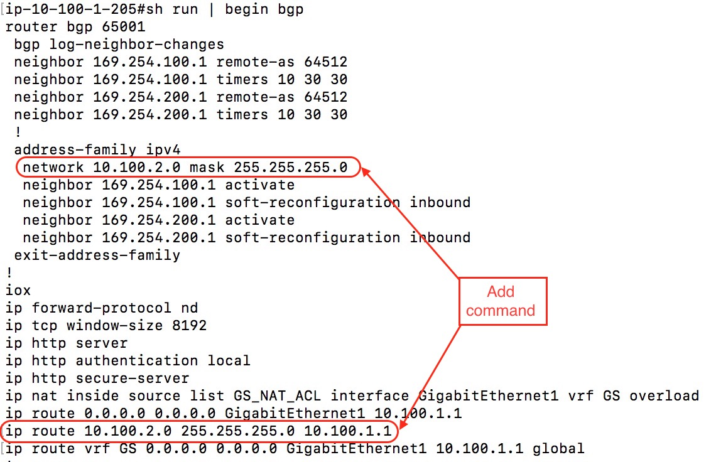

4) Verify the BGP Route Table and VPN Status

Use the Cisco commands below to verify the VPN status and BGP routes.

* Type **show ip interface brief** to show the interface status

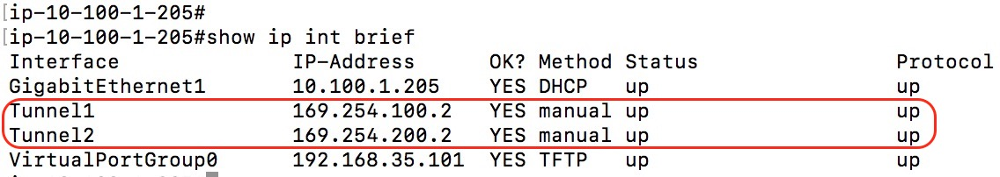

* Type **show ip bgp** to confirm the routing entries 10.1.0.0/16, 10.10.0.0/16 and 10.20.0.0/16 are exist, and the **Next Hop** is 169.254.100.1 and 169.254.200.1.  

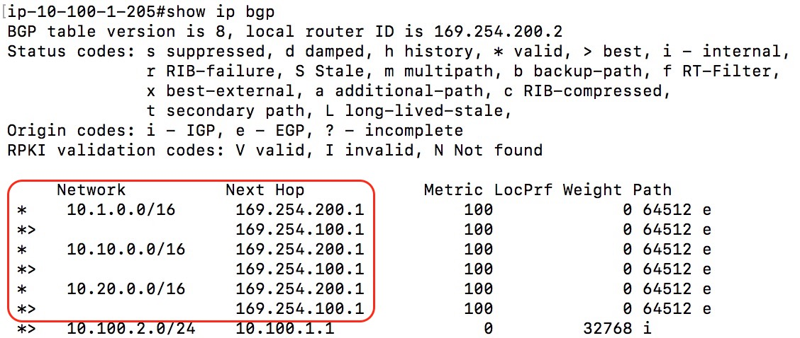

Back to Site-to-Site VPN Connections console, select the connection you created for this lab and view the **Tunnel Details**. There are two tunnels you will see and each tunnel has 1 BGP route.

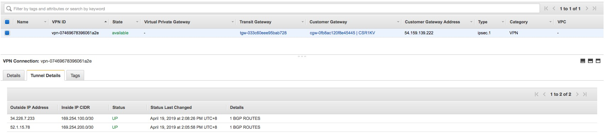

Open Transit Gateway Route Tables console in the navigation pane, select the default route table and view the **Routes**. You will be able to see a route that the CIDR is 10.100.2.0/24 which came from VPN.  

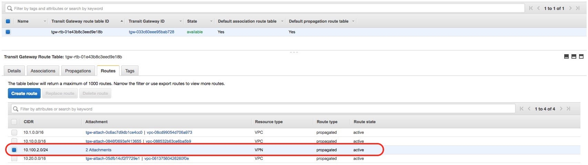

5) Create a new Transit Gateway Route Table to Isolate the Traffic

Before creating a new Transit Gateway route table, we must remove the association of VPC10/VPC20 from default route table. So, select the default Transit Gateway route table, select the **Attachment ID** binded to VPC10 and choose **Delete association**.(You can view the attachment relationship in **Transit Gateway Attachments** console) Repeat the step for removing VPC20 from default route table.

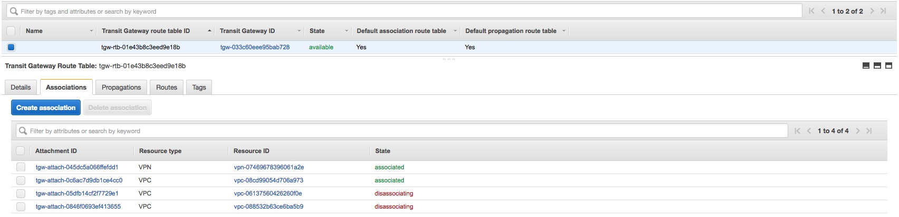
   
Open Transit Gateway Route Tables console, click **Create Transit Gateway Route Table**, type **Isolated Traffic**, select the Transit Gateway created before and click **Create Transit Gateway Route Table**.

Select the **Isolated Traffic** and click **Create association**. 

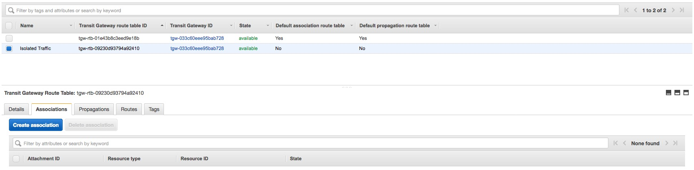

Select **VPC10** for **Choose attachment to associate** and click **Create association**. Repeat the step for associating attachment of VPC20.

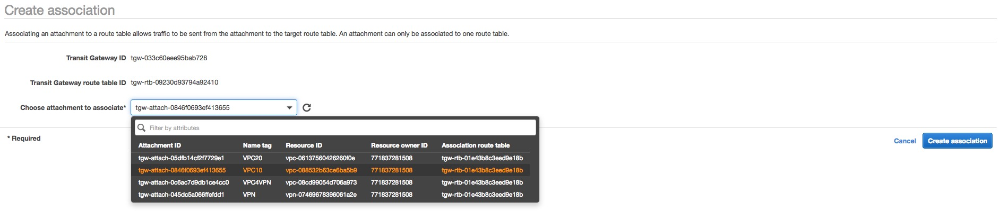

Choose **Create propagation**, select **VPN** for **Choose attachment to propagate** and click **Create propagation**. Repeat the step for creating propagation of **VPC4VPN**. Finally, you will see the status of route table like the screenshots below.

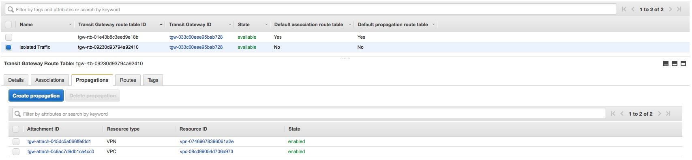

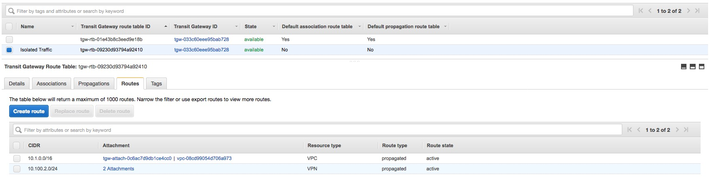

6) Add the On-premises Route Entry into VPC Route Table

Now, we have to add on-premises route entry(10.100.2.0) into VPC route table of VPC10, VPC20  and VPC4VPN. Choose **Route Tables**, select VPC10-RT, clcik **Edit routes** under **Routes** tab. Click **Add route**, type **10.100.2.0/24** for **Destination** and select **tgw-xxxxx** for **Target**. Click **Save routes**.
Repeat the step to add the route into **VPC20-RT** and **VPC4VPN-RT**.

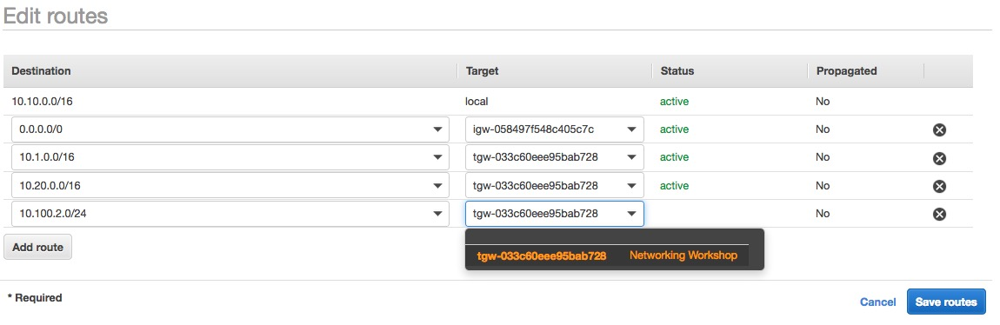

Add route **10.0.0.0/8** with **Tagert** **CSR1KV** into main route table of **VPC4OnPremises-RT**. This route entry is for **VPC4OnPremises-PrivateSN**(10.100.2.0/24). The traffic heads to VPC10, VPC20 and VPC4VPN will be routed to CSR1000V for route selection.

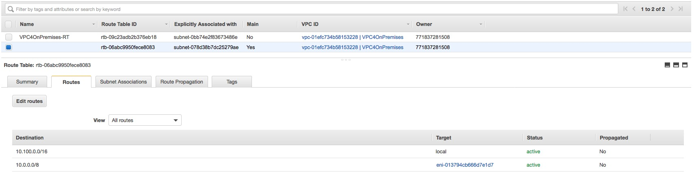

7) Launch an EC2 Instance in VPC4OnPremises-PrivateSN

To test the network connectivity behind the CSR1000V, we need to launch an EC2 instance with private IP only in **VPC4OnPremises-PrivateSN**. Follow the link below if you don't know how to launch a Linux EC2 instance.

<https://docs.aws.amazon.com/quickstarts/latest/vmlaunch/welcome.html>
   

8) Test the Routing Behavior

SSH into the instance in VPC10 and do the ping test, and your ping result will be the same as the screenshot below. 

*  ping the instance in VPC20 (ex: 10.20.1.152)
*  ping the instance in VPC4VPN (ex: 10.1.1.25)
*  ping the instance in VPCOnPremises-PrivateSN (ex: 10.100.2.136)

**Question : Do you know why instance in VPC10 cannot successfully ping the instance in VPC20?**

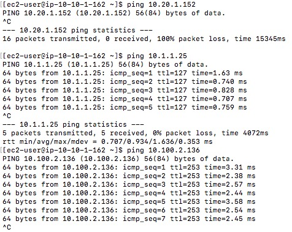

Open Tunnelblick, establish OpenVPN connection and ping the same target as last step from your local laptop. 

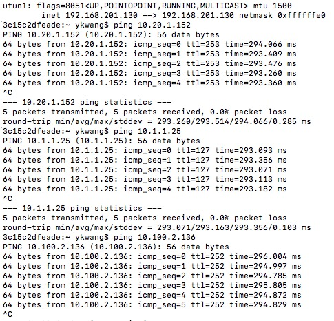

**Great!! We successfully control the routng policy in AWS Transit Gateway. Now, all traffic which originates from VPC10 and VPC20 will only access shared services VPC and on-premises VPC. Traffic between VPC10 and VPC20 will be dropped because of lack of routing entry in Transit Gateway route table. This is the common scenario enterprise customers would like to achieve, and you can also make some changes for service insertion and VPC segmentation.**

